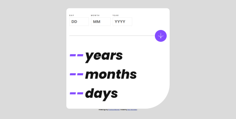
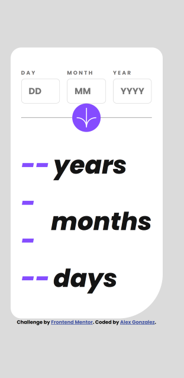

# Frontend Mentor - Age calculator app solution

This is a solution to the [Age calculator app challenge on Frontend Mentor](https://www.frontendmentor.io/challenges/age-calculator-app-dF9DFFpj-Q). Frontend Mentor challenges help you improve your coding skills by building realistic projects.

## Table of contents

- [Frontend Mentor - Age calculator app solution](#frontend-mentor---age-calculator-app-solution)
  - [Table of contents](#table-of-contents)
  - [Overview](#overview)
    - [The challenge](#the-challenge)
    - [Screenshot](#screenshot)
    - [Links](#links)
  - [My process](#my-process)
    - [Built with](#built-with)
    - [What I learned](#what-i-learned)
    - [Continued development](#continued-development)
    - [Useful resources](#useful-resources)
  - [Author](#author)

## Overview

### The challenge

Users should be able to:

- View an age in years, months, and days after submitting a valid date through the form
- Receive validation errors if:
  - Any field is empty when the form is submitted
  - The day number is not between 1-31
  - The month number is not between 1-12
  - The year is in the future
  - The date is invalid e.g. 31/04/1991 (there are 30 days in April)
- View the optimal layout for the interface depending on their device's screen size
- See hover and focus states for all interactive elements on the page

### Screenshot

**Desktop**

**Mobile**

### Links

- Solution URL: [Github Repo](https://github.com/luinrandir/age-calulator-app)
- Live Site URL: [Live Demo](https://luinrandir.github.io/age-calculator-app)

## My process

### Built with

- Semantic HTML5 markup
- CSS custom properties
- Flexbox
- CSS Grid
- Mobile-first workflow
- JavaScript
- Jest

### What I learned

One of the most important things I took away from this challenge was the use of testing in a development environment. After completing the layout, I decided to use **Jest** to help guide myself with the main logic of the application. Oddly enough, calculating age and giving results in years, months, and days was oddly challenging. Generally, we calculate age only on year, diving into months if necessary. However, calculating the amount of days made it awkwardly difficult. It did take a while to figure out the logic as I battled my instinctive way of completing the math. Thankfully, after finding a video, which was oddly difficult to find, I decided to follow my initial instinct about figuring out the math for the application.

Aside from that, this was the first time I completely used **JavaScript** to validate a **HTML** form. It was a huge learning experience and more detailed than I thought of. After completing this challenge, which was a step up from the novice ones I have done, I learned, with difficulty, keeping all of my code in one single file. This challenge has really pushed me to look into tools such as **Webpack** to start creating a module **JavaScript** workflow.

### Continued development

The biggest thing that I want to continue with is form validation practice. The videos that I have found were fantastic and very helpful in guiding me with my own form for this application.

### Useful resources

- [JS Form Validation Pt. 1](https://www.youtube.com/watch?v=iyngFd6f8ko) - This helped with form validation with JavaScript.
- [JS Form Validation Pt. 2](https://www.youtube.com/watch?v=vrFnwDJmvBk) - This helped with form validation with JavaScript.
- [Calculating duration of Dates with Pen and Paper](https://www.youtube.com/watch?v=NENmT5wCapQ) - Great resource for the math behind calculating duration of time between dates. It feels oddly not straight forward.

## Author

- Github - [@luinrandir](https://github.com/luinrandir)
- Frontend Mentor - [@luinrandir](https://www.frontendmentor.io/profile/luinrandir)
